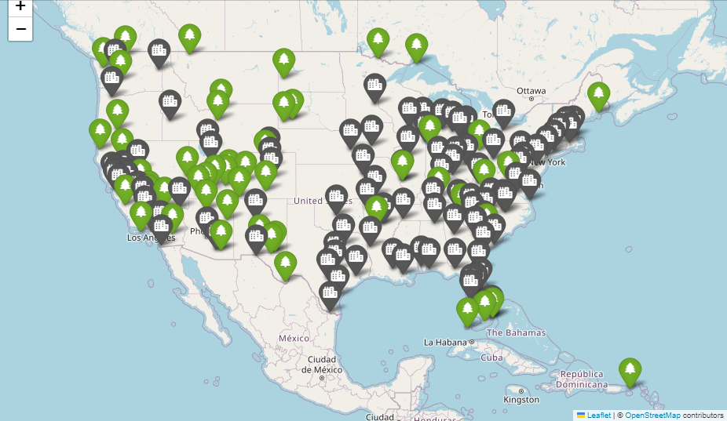
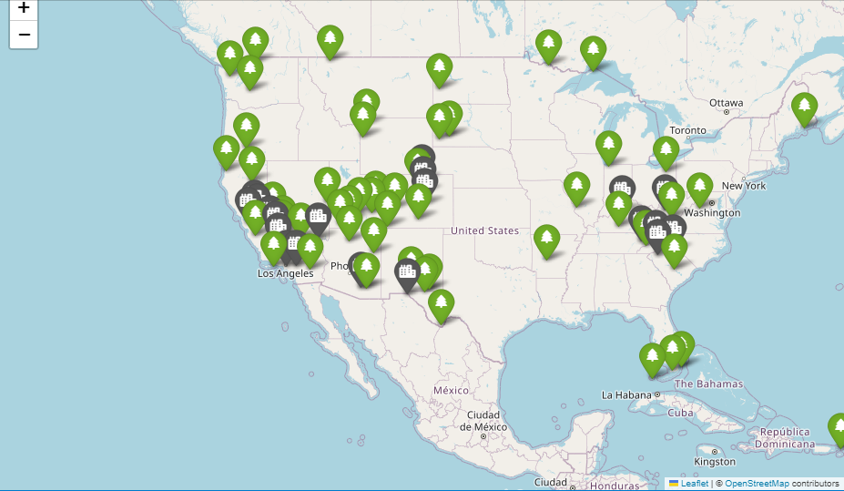

# Best Places to Live for National Park Lovers

The aim of this project was to identify the best cities for individuals who love visiting U.S. national parks frequently. By analyzing the distances between top U.S. Metropolitan Statistical Areas (MSAs) and national parks, we could make data-driven recommendations on optimal places to live for park enthusiasts.

## Initial Conclusions

This project highlighted a few key metro areas that have a high degree of proximity to multiple national parks:

**Best All-Around MSA: Fresno, CA**:
Fresno emerges as the standout metro area for accessibility to national parks. Located in California's Central Valley, Fresno is within 300 miles of 8 national parks, and 4 of these are within a 100-mile radius, including Yosemite, Sequoia, and Kings Canyon National Parks. This exceptional park proximity, combined with Fresno Yosemite International Airport (FAT), makes Fresno an ideal gateway for those who wish to explore the natural beauty of the United States. Fresno’s central location positions it as a hub for outdoor recreation and nature tourism, offering unparalleled access to some of the nation's most iconic landscapes.

**Best Very Large MSA: Los Angeles-Long Beach-Anaheim, CA**:
As the second most populous metropolitan area in the United States, Los Angeles offers a surprising level of access to national parks. While only one national park (Channel Islands) is within 100 miles, Los Angeles sits within 300 miles of 6 additional national parks, including Joshua Tree, Sequoia, and Death Valley. Los Angeles International Airport (LAX), one of the busiest airports in the world, is also conveniently located nearby. The variety of ecosystems accessible from Los Angeles, ranging from desert landscapes to alpine forests, is simply unmatched, making it a top home base choice for nature lovers who value diversity and urban convenience.

**Best East Coast MSA: Charlotte-Concord-Gastonia, NC-SC**:
Charlotte stands out as one of the top East Coast metro areas for access to national parks and natural attractions. Within 300 miles, residents and visitors can explore the Great Smoky Mountains National Park, the Blue Ridge Parkway, and Congaree National Park's unique swamp ecosystems. Additionally, weekend trips are feasible to Shenandoah National Park and New River Gorge National Park and Preserve, providing a wide range of landscapes, from rugged mountain terrain to lush forests and wetlands. Charlotte’s position as a transportation hub, with the Charlotte Douglas International Airport (CLT), enhances its accessibility for travelers. This blend of urban amenities, rich biodiversity, and proximity to iconic national parks makes Charlotte an ideal base for nature enthusiasts in the southeastern United States.

## Explore the Analysis

You can access the full analysis and explore some interactive maps in the [Jupyter Notebook](https://github.com/keeganmcgarry/national_parks_proximity_analysis/blob/main/national_parks_proximity_analysis.ipynb).

## Data

This project utilizes two main datasets:

1. **National Park Data**: A list of 63 U.S. National Parks.
2. **MSA Data**: Information on the top 100 Metropolitan Statistical Areas (MSAs) in the United States by population.

Both datasets were compiled and cleaned with the help of ChatGPT and are stored in CSV format in the data folder.
